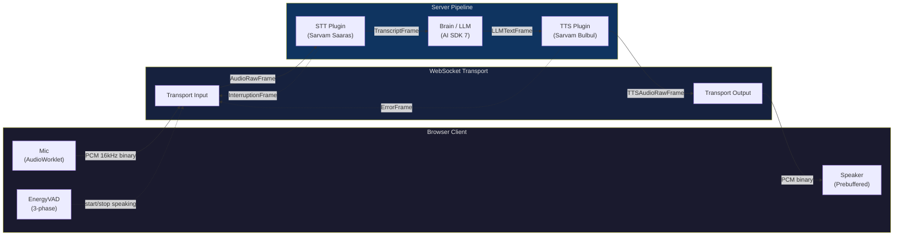
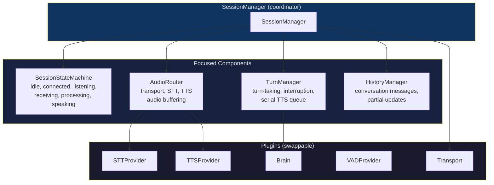
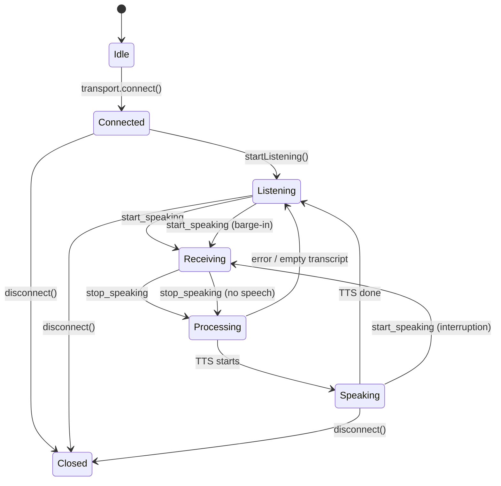
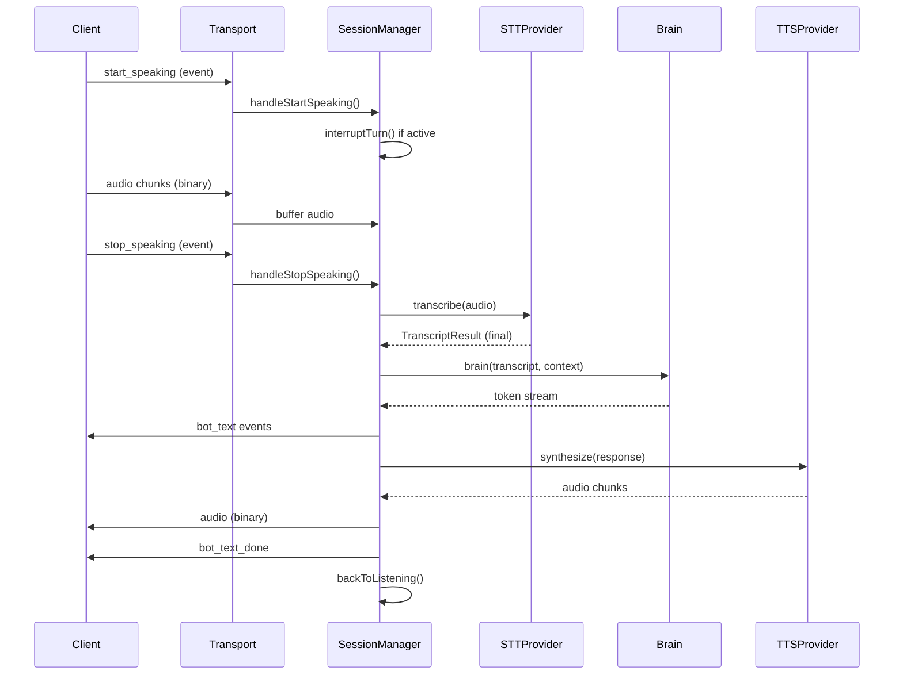
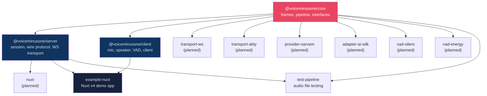
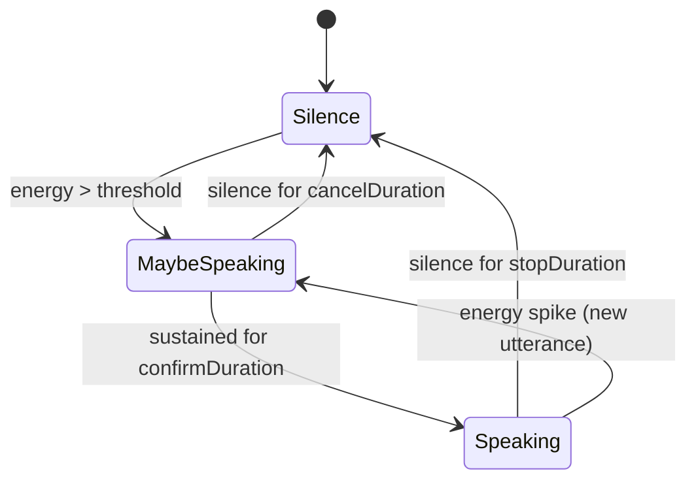

# VoiceMinusOne

> Plugin-based voice SDK for application-based AI voice agents. Real-time voice layer for chat apps, co-pilots, creative tools, and in-browser assistants. Not telephony. Not WebRTC. Pure TypeScript/Node.js.

[]()
[]()

## What is this?

VoiceMinusOne is a real-time voice layer for AI agents. The user sits at a device with a mic and speakers, and an AI agent is embedded in their app. Every segment — STT, TTS, LLM, transport, VAD, audio processing — is a swappable plugin. No vendor lock-in.

```typescript
import { createVoiceSession } from '@voiceminusone/core'
import { sarvam } from '@voiceminusone/provider-sarvam'
import { aiSdkBrain } from '@voiceminusone/adapter-ai-sdk'
import { wsTransport } from '@voiceminusone/transport-ws'
import { sileroVAD } from '@voiceminusone/vad-silero'

const session = createVoiceSession({
  transport: wsTransport({ url: 'ws://localhost:3001' }),
  stt: sarvam.stt({ apiKey: process.env.SARVAM_API_KEY, model: 'saaras:v3' }),
  tts: sarvam.tts({ apiKey: process.env.SARVAM_API_KEY, model: 'bulbul:v3', speaker: 'shubh' }),
  brain: aiSdkBrain({ model: openai('gpt-4o') }),
  vad: sileroVAD(),
})
```

## Architecture

**Hybrid pipeline**: Frame-based core (inspired by pipecat) with stream adapters at provider boundaries (inspired by micdrop). Data flows as typed Frames through a directional pipeline — downstream for normal data, upstream for errors and interruptions. Providers implement simple async iterables that the framework adapts to frames.

### Pipeline data flow



### Session architecture (no god classes)



### Session state machine



### Turn lifecycle



### Package dependency graph



### VAD three-phase state machine



**No god classes.** The session is split into focused, independently testable components:
- `SessionStateMachine` — state transitions
- `TurnManager` — turn-taking, interruption, serial TTS queue
- `AudioRouter` — routes audio between transport/STT/TTS
- `HistoryManager` — conversation messages

## Packages

| Package | Description |
|---------|-------------|
| `@voiceminusone/core` | Frame types, FrameProcessor, Pipeline, plugin interfaces, errors, logger, clock |
| `@voiceminusone/server` | SessionManager, wire protocol (zod-validated), WebSocket transport |
| `@voiceminusone/client` | Mic (AudioWorklet), Speaker (prebuffered gapless), EnergyVAD, VoiceMinusOneClient |
| `@voiceminusone/provider-sarvam` | Sarvam STT (Saaras v3, WebSocket streaming) + TTS (Bulbul v3, HTTP streaming) |
| `@voiceminusone/adapter-ai-sdk` | Vercel AI SDK 7 → Brain adapter (streaming + complete modes) |
| `@voiceminusone/transport-ably` | Ably pub/sub transport (binary extras, not base64) |
| `@voiceminusone/vad-silero` | Silero VAD via ONNX Runtime Web (WASM) |
| `@voiceminusone/vad-energy` | Energy-based VAD (zero-dependency fallback) |
| `@voiceminusone/nuxt` | Nuxt v4 server module (crossws WebSocket handler) |
| `@voiceminusone/test-pipeline` | Automated end-to-end test from an audio file |

## Quick start

### Prerequisites

- Node.js >= 20
- pnpm >= 9

### Install

```bash
git clone https://github.com/NormVg/VoiceMinusOne.git
cd VoiceMinusOne
pnpm install
```

### Build

```bash
pnpm build
```

### Run tests

```bash
# Unit + integration tests (112 tests)
pnpm test

# Automated audio pipeline test (reads test/test-clip.mp3)
pnpm test:audio

# Browser automation test (launches Nuxt app + headless Chrome)
cd examples/nuxt-voice
pnpm test:browser
```

### Run the example app

```bash
cd examples/nuxt-voice

# Build the Nuxt app
pnpm build

# Start the preview server
node .output/server/index.mjs

# In another terminal, run the browser test
node test/browser-test.mjs
```

The example app starts a WebSocket server on port 3001 with mock STT/TTS/Brain providers. Open `http://localhost:3000` in a browser and click Connect.

## Plugin system

Every segment is a plugin with a TypeScript interface. Providers export factory functions:

```typescript
import type { STTProvider, AudioChunk, TranscriptResult, STTConfig } from '@voiceminusone/core'

export class MySTT implements STTProvider {
  readonly name = 'my-stt'

  async *transcribe(
    audio: AsyncIterable<AudioChunk>,
    config: STTConfig,
  ): AsyncIterable<TranscriptResult> {
    for await (const chunk of audio) {
      // Send to your STT API, yield transcripts
      yield { text: '...', isFinal: false }
    }
  }

  async init() {}
  async start() {}
  async stop() {}
  async destroy() {}
}

// Factory
export const myStt = (options: MySTTOptions): STTProvider => new MySTT(options)
```

Plugins receive a `PluginContext` with lifecycle hooks, logger, event bus, and clock:

```typescript
interface PluginContext {
  readonly logger: Logger
  readonly events: EventBus
  readonly clock: Clock
  readonly signal: AbortSignal
}
```

## Tech stack

| Concern | Technology |
|---------|-----------|
| Language | TypeScript (strict, `noUncheckedIndexedAccess`, `exactOptionalPropertyTypes`) |
| Runtime | Node.js >= 20 |
| Package manager | pnpm with workspaces |
| Bundler | tsup |
| Tests | Vitest |
| Linter | Biome |
| Schema validation | zod |
| WebSocket (Nuxt) | crossws |
| WebSocket (Node) | ws |
| Pub/sub | Ably |
| AI/LLM | Vercel AI SDK 7 |
| STT/TTS | Sarvam AI (Saaras v3, Bulbul v3) |
| VAD | Silero (ONNX Runtime Web) + energy-based fallback |
| Framework | Nuxt v4 |

## Design principles

1. **Plugin-first** — Every capability is a swappable plugin. Core has zero opinions on providers.
2. **No vendor lock-in** — Swap any plugin without changing application code.
3. **No god classes** — Split concerns into focused, independently testable components.
4. **No `any`** — Every interface is fully typed, including framework adapters.
5. **No silent errors** — Every `catch` logs. Wire protocol validated with zod.
6. **No base64 audio** — Binary WebSocket frames only. No 33% overhead.
7. **No deprecated APIs** — AudioWorklet, never ScriptProcessorNode.
8. **No Python** — Pure TypeScript/Node.js end to end.

## Reference projects

Three reference repos were studied deeply (guides in `.info/guides/`):

| Repo | What we learned |
|------|----------------|
| [micdrop](https://github.com/Godefroy/micdrop) | Three-abstraction model, stream-based pipeline, fallback chains, VAD state machine |
| [pipecat](https://github.com/pipecat-ai/pipecat) | Frame-based directional pipeline, dual-queue priority, transport as processor pair |
| [voice-line](https://github.com/NormVg/voice-line) | What NOT to do: god-class Session, broken pipeline, pervasive `any` |

## License

MIT
